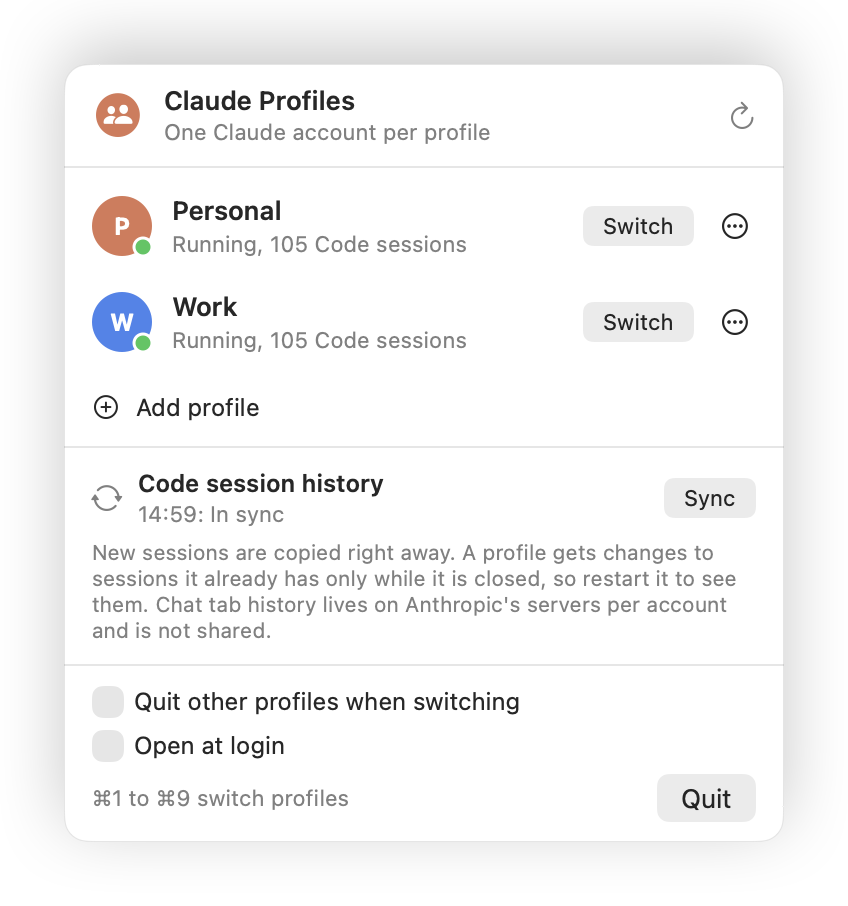

# Claude Profiles

A macOS menu bar app that runs Claude Desktop under several accounts side by side, for example a personal and a work account, and switches between them in one click. It can also share your Code tab session history between those accounts.

> **Unofficial.** Not affiliated with or endorsed by Anthropic. It relies on Electron's `--user-data-dir` flag and on Claude Desktop's internal session file layout. A Claude Desktop update can change either one.

<picture>
  <source media="(prefers-color-scheme: dark)" srcset="docs/menu-dark.png">
  
</picture>

## What it does

- **One profile per account.** A profile is a separate Claude data folder, signed in to its own account. The default profile is Claude's own folder (`~/Library/Application Support/Claude`). Profiles can run at the same time.
- **Switch in one click.** Click a profile, or press ⌘1 to ⌘9 while the menu is open. A running profile comes to the front and its window reopens if you had closed it. A stopped profile is started.
- **Add a profile.** A new Claude window opens; sign in there with the other account. You can also point a profile at an existing folder. Folders like `~/ClaudeWork` that you already started with `--user-data-dir` are picked up on first run.
- **Share Code tab history.** Sessions you start in the Code tab of one profile show up in the others.
- Optional: close the other profiles when you switch, and start at login.

## Sharing Code session history

Claude Desktop keeps each Code session in two places:

- the transcript, in `~/.claude/projects/`, which every profile already reads;
- a small session record, in `<data folder>/claude-code-sessions/<account>/<org>/local_<id>.json`, which decides what the sidebar lists.

Claude Profiles copies those records between the profiles that have sharing turned on. Claude refuses session files reached through a symlink or a hard link, so the records are copied, not linked. The rules:

- A session missing from a profile is copied in, about once a minute and whenever a profile starts or quits.
- A session present on both sides is replaced by the copy with the newer activity, but only while the receiving profile is closed. A running Claude keeps its sessions in memory and would write over the change.
- Claude reads its session list when it starts, so restart a profile (⋯ menu, *Restart*) to see sessions copied into it.
- A session you remove from one profile stays removed there.
- Remote Control links belong to one account and are dropped when a record crosses to another account.

Not shared: **Chat tab history**, which lives on Anthropic's servers per account, and Cowork sessions.

Keep in mind:

- When you continue a session from account A inside account B, its context is sent under account B.
- Don't keep the same session open in two profiles at once.

## Install

Requires macOS 13 or later and Claude Desktop. The app is universal (Apple silicon and Intel).

**One command.** Downloads the latest release, checks its SHA-256, installs it into `~/Applications` and starts it:

```bash
curl -fsSL https://raw.githubusercontent.com/maycuatroi1/claude-profiles/main/scripts/get.sh | bash
```

**Download.** Get `Claude-Profiles-<version>.zip` from [Releases](https://github.com/maycuatroi1/claude-profiles/releases/latest), unzip it and move `Claude Profiles.app` to Applications. The app is not notarized, so macOS blocks the first launch of a browser download. Open System Settings, Privacy & Security, and click *Open Anyway*, or run:

```bash
xattr -dr com.apple.quarantine "/Applications/Claude Profiles.app"
```

**From source.** Needs a Swift 5.9+ toolchain (Xcode or `xcode-select --install`):

```bash
git clone https://github.com/maycuatroi1/claude-profiles.git
cd claude-profiles
make install
```

Look for the two-person icon in the menu bar. The first time you switch to a running profile, macOS may ask whether Claude Profiles may control Claude; that permission is what reopens a closed Claude window.

## Terminal commands

The app binary answers a few commands too:

```bash
app="$HOME/Applications/Claude Profiles.app/Contents/MacOS/ClaudeProfiles"
"$app" --list               # profiles, accounts, Code session counts; * marks running ones
"$app" --list --json
"$app" --open work          # switch to a profile by id or name
"$app" --sync --dry-run     # count what a sync would copy
"$app" --sync
```

## Where things live

| What | Where |
| --- | --- |
| Profile list and settings | `~/Library/Application Support/tech.omelet.ClaudeProfiles/profiles.json` |
| Sync state | `~/Library/Application Support/tech.omelet.ClaudeProfiles/sync-state.json` |
| Data folders of new profiles | `~/Library/Application Support/tech.omelet.ClaudeProfiles/Profiles/<id>` |

## Uninstall

Quit the app from its menu and delete `Claude Profiles.app`, or from a clone run `make uninstall`. This removes the app. Profiles, Claude data folders and sessions stay where they are.

## Development

```bash
make test       # unit tests (swift test)
make app        # release build of build/Claude Profiles.app
make snapshot   # draw the menu with your real profiles to build/menu.png
UNIVERSAL=1 make app   # arm64 + x86_64 (needs full Xcode)
```

Releases: bump `VERSION`, commit, then push a matching tag (`git tag v0.2.0 && git push origin v0.2.0`). The release workflow tests, builds the universal app and publishes the zip with its checksum.

Source layout, under `Sources/ClaudeProfiles/`:

- `Core/` - profiles, account detection, running instances, launching, session sync
- `App/` - entry point and the observable app model
- `Views/` - SwiftUI views of the menu window
- `Support/` - terminal commands and the icon renderer

## License

MIT
